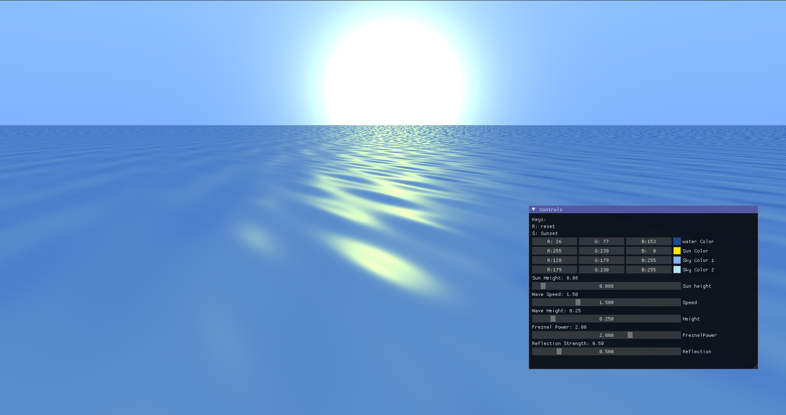
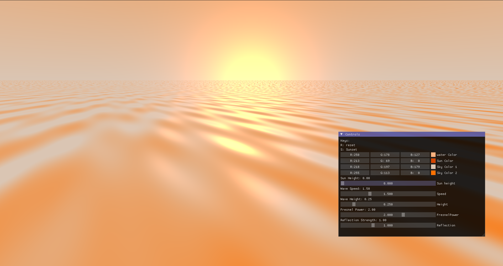
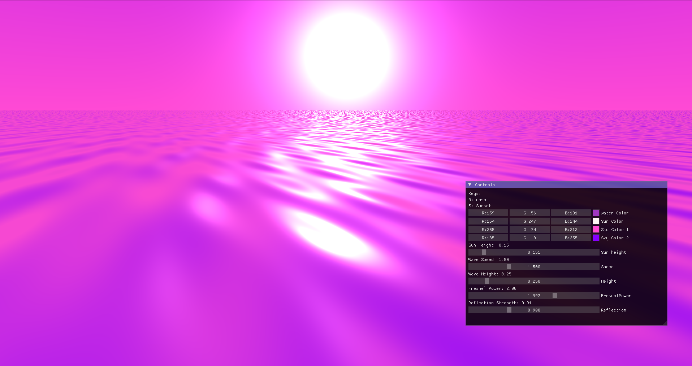

# Ocean Simulation
> Real time ocean renderer built with **OpenGL** and **GLSL**, featuring dynamic wave simulation, with customizable effects.





## Try it out
**[Download pre-built version from itch.io (for Linux)](https://shahd-moh-abdel.itch.io/ocean-simulation)**
*No setup required, download and run!*

## Tech Stack
- OpenGL 
- GLSL
- GLAD
- GLFW
- Dear ImGui
- c++

## Build from Source

### Prerequisites
Make sure you have:
- C++ compiler
- Git

#### Linux 
```bash
	bash build.bash
```

then run:
```bash 
	./app
```

#### Windows
It won't work for now but I might fix it later.

## Controls
- ESC - Exit application
- R - Reset to default parameters
- S - Switch to sunset preset

## Contributing
> If you are on windows, you can try adding build instructions for it.

**Enjoy exploring the parameters**
